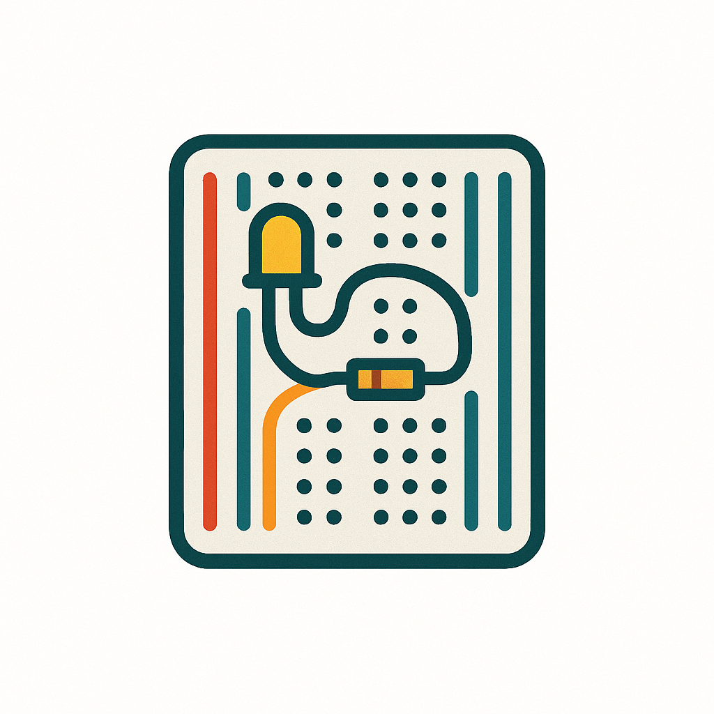
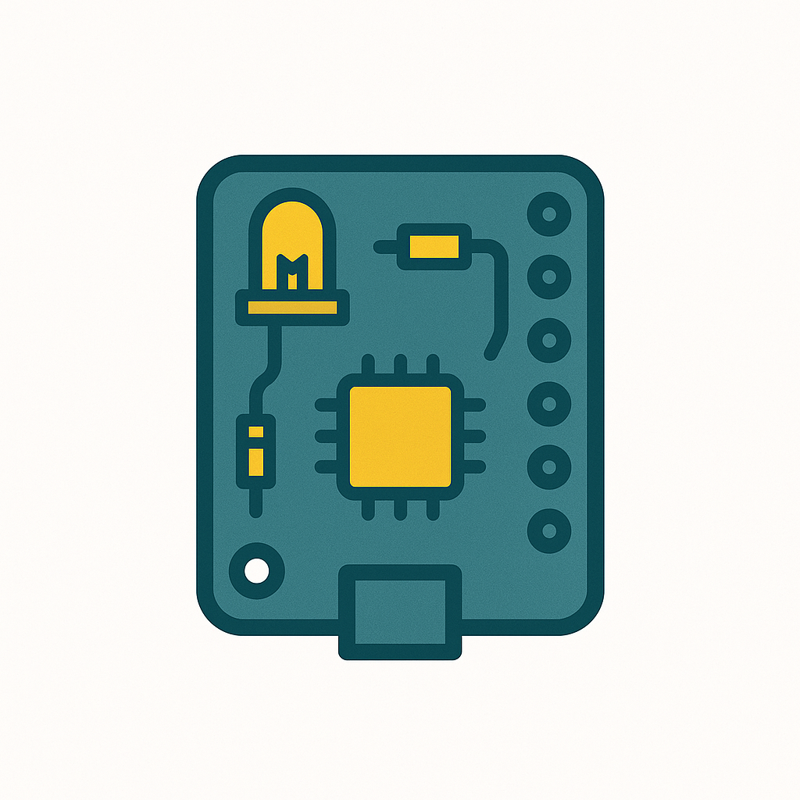

# Make with boards

These projects assume you've never before used boards such as Raspberry Pi or Arduino, have little to no programming knowledge, aren't particularly aligned towards tinkering with machines unless no one else is around to do so, and have used only Windows laptops. Like me.

These projects are beginner-friendly and practical. They require no soldering.

