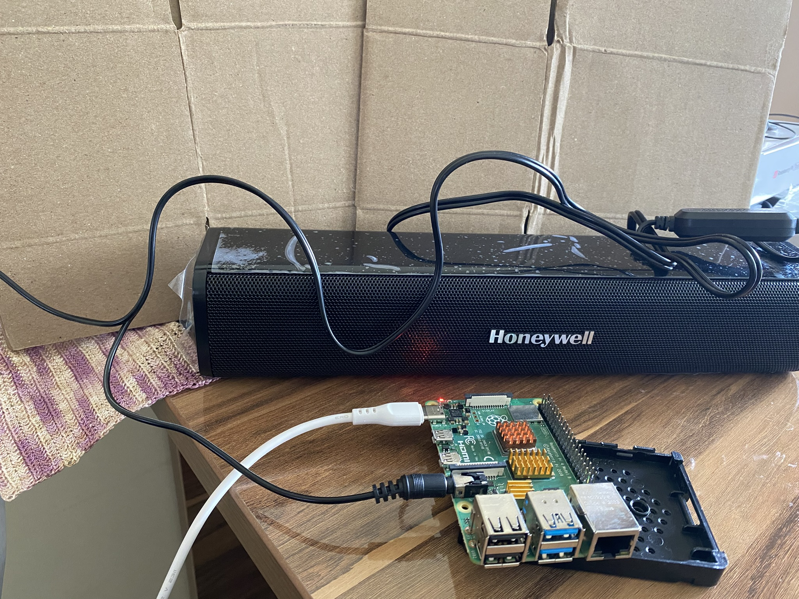

#  Make chimes on the hour and half hour

The steps to make the chimes are these:

1. Attach the heat sinks to the Raspberry Pi board.
1. Prepare your laptop.
1. Download the Raspberry Pi operating system.
1. Install the operating system.
1. Write the Python code that makes the chimes.

 
To see a larger image, click the image.













