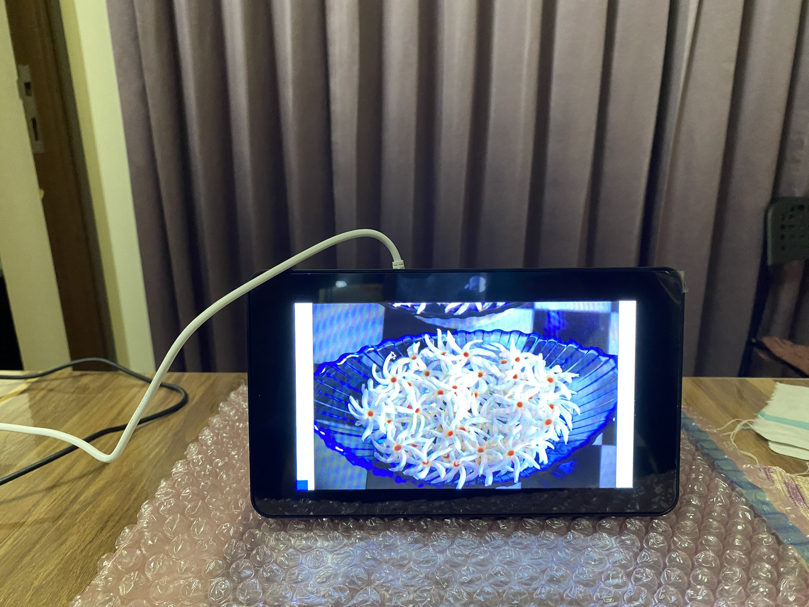

#  Make a digital photo frame

The steps to build the digital photo frame are these:

1. Attach the touch display to the Raspberry Pi board.
1. Attach the heat sinks to the Raspberry Pi board.
1. Prepare your laptop.
1. Download the Raspberry Pi operating system.
1. Install the operating system.
1. Write the Python code that displays the photos.
1. Refine the project.

 
To see a larger image, click the image.

















