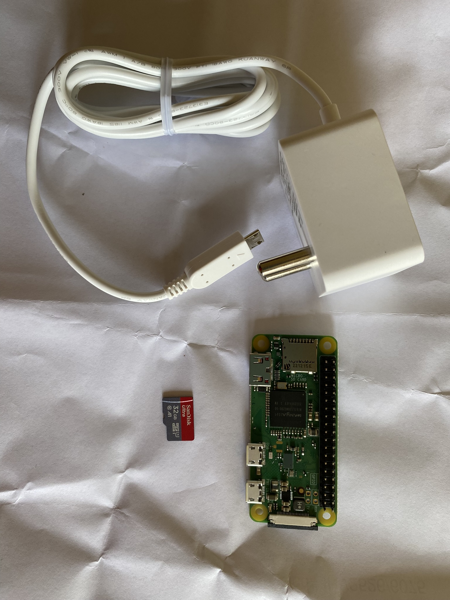
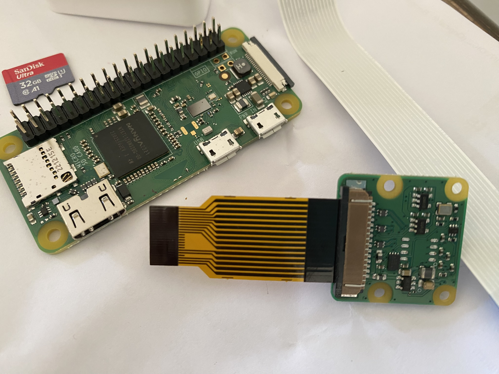

#  Make a surveillance camera

These are the steps:

1. Prepare your laptop.
1. Download the Raspberry Pi operating system.
1. Install the operating system.
1. Attach the camera
1. Write the bash code that makes the videos.
1. Refine the project.

 
To see a larger image, click the image.















